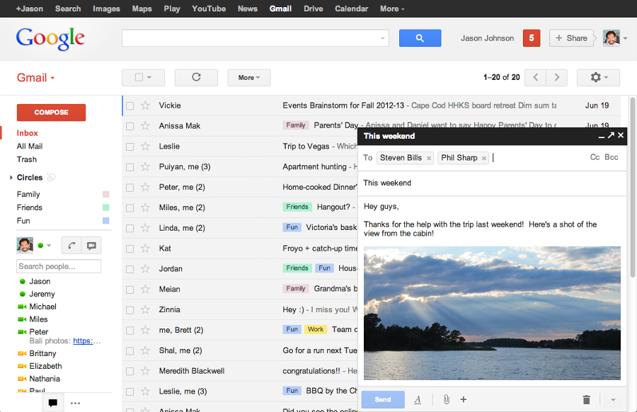
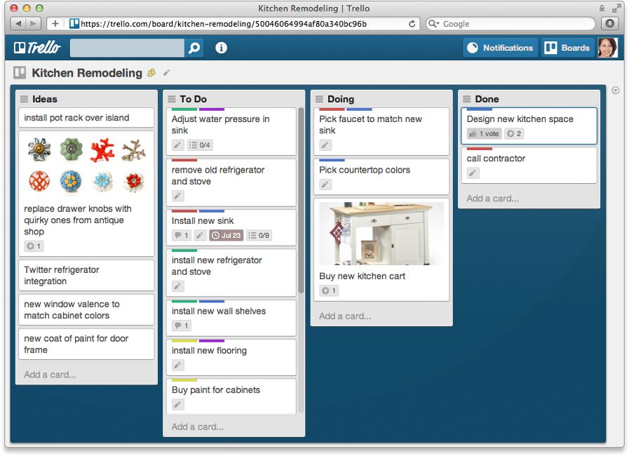

!SLIDE ============================

!SLIDE ============================

## _HTML enhanced_
## _for web apps!_

!SLIDE image ============================

!SLIDE image ============================

!SLIDE bullets ============================

# framework client

* couche de présentation entièrement dans le navigateur web
* serveur web : fichiers statiques
* _Single Page Application_
* communique avec des web services
    * requêtes HTTP
    * services REST ou non
    * échanges de données au format JSON ou autre

!SLIDE bullets ============================

# principes d'AngularJS

* Templates déclaratifs en HTML (étendu) avec data binding
* Vue dynamique rafraîchie automatiquement
* Directives : extensions du HTML
* Services avec injection de dépendances
* Travaille avec des POJO (data binding, services)
* Gestion du routage interne
* Testable : tests unitaires et tests fonctionnels

!SLIDE bullets ============================

# 3 types de composants

* filtres : fonctions globales utilisables dans les expressions des templates
* services : logique métier ou logique de présentation
* directives : composants des templates (extensions du HTML)

!SLIDE bullets ============================

# FILTRES

* créés dans un module
* fonctions globales pouvant recevoir des arguments
* disponibles dans toutes les expressions des templates
* utilisés pour formater des données, pour filtrer une liste

!SLIDE bullets ============================

# SERVICES

* créés dans un module
* singletons
* objet quelconque, ou même donnée primitive
* injectés comme dépendances

!SLIDE bullets ============================

# injection des dépendances

* basée sur le nom des arguments
* injection
    * dans un contrôleur
    * dans la factory d'un service, d'un filtre, d'une directive
* le service à injecter est instancié si nécessaire par AngularJS
    * une seule fois
    * puis conservé indéfiniment

!SLIDE bullets ============================

# utilisation des services

* services techniques ou fonctionnels
    * services techniques du framework
* fonctions, objets avec diverses méthodes
* conserver des données
* regrouper tous les aspects d'une fonctionnalité métier
    * ses données
    * ses méthodes

!SLIDE bullets ============================

# DIRECTIVES

* créées dans un module
* utilisées dans les templates
* déclenchées par un nom d'élément ou d'attribut HTML
* exécutées une seule fois lors de la compilation du template
    * mais elles peuvent placer des listeners
* fonction _compile_ et/ou fonction _link_
    * **compile** : compilation du template
    * **link** : liens entre le template et les données du scope

!SLIDE bullets ============================

# API d'une directive

* valeurs des attributs de l'élément HTML
    * texte (contenant éventuellement des expressions entre `{{...}}`)
    * expression évaluée comme data binding
    * expression évaluée lors d'une action (ex: clic)

!SLIDE ============================

## directive **ngBind**

    module.directive('ngBind', function() {

      return {
        restrict: 'A',
        priority: 0,
        scope: false,

        link: function(scope, element, attr) {

          scope.$watch(attr.myBind, function (value) {
            element.text(value == undefined ? '' : value);
          });
        }

      };

    });

!SLIDE bullets ============================

# composition de composants

* packagés ensemble dans un module
* filtre + service utilisé dans le filtre
* directive + service utilisé dans la directive
* service utilisant d'autres services
* directive avec un template utilisant d'autres directives
* plusieurs directives partageant un même contrôleur

